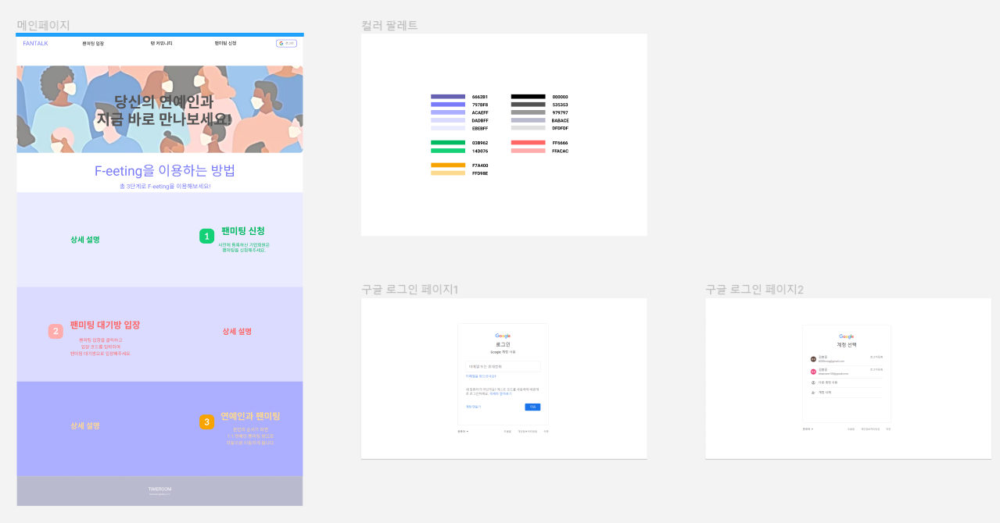
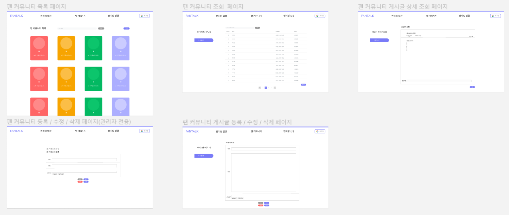
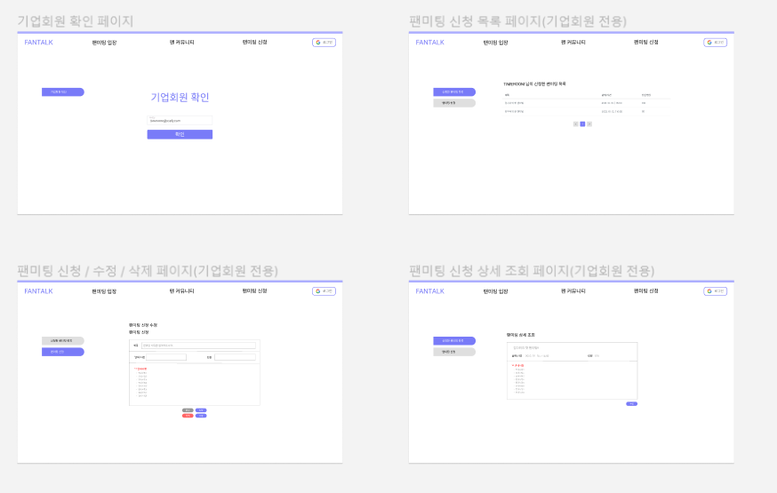
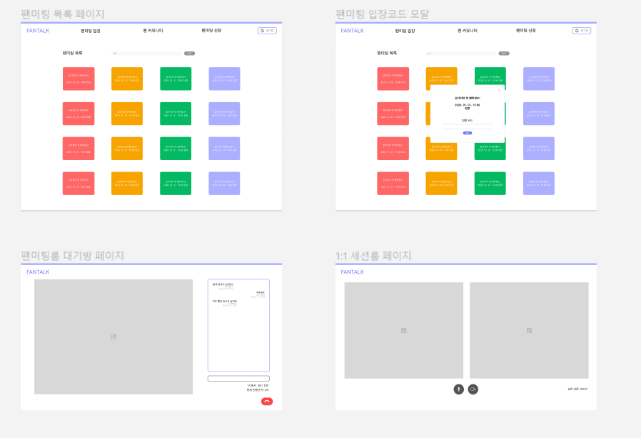

### 환경설정

- IntelliJ Ultimate 설치

  - Github Education 계정을 통해 Ultimate 버전 설치


- MySQL 설치


<br>

## Spring

- 객체 지향 프로그래밍의 SOLID (이번 프로젝트에서 꼭 지키도록 노력!!)

  - SRP: 단일 책임 원칙

    - 하나의 클래스는 하나의 책임만 가져야 한다.
    - 예를 들어서 객체의 생성과 사용의 클래스를 분리

  - OCP: 개방-폐쇄 원칙

    - 소프트웨어 요소는 확장에는 열려있으나 변경에는 닫혀 있어야 한다.
    - 예를 들어 다형성을 기본으로 인터페이스를 만들고 구현체 클래스를 생성

  - LSP 리스코프 치환 원칙

    - 프로그램의 객체는 프로그램의 정확성을 깨뜨리지 않으면서 하위 타입의 인스턴스로 바꿀 수 있어야 한다.

  - ISP 인터페이스 분리 원칙

    - 특정 클라이언트를 위한 인터페이스 여러 개가 범용 인터페이스 하나보다 낫다
    - 인터페이스를 보다 더 명확하게 한다.

  - DIP 의존관계 역전 원칙

    - 추상화에 의존해야지, 구체화에 의존하면 안된다.
    - 구현 클래스에 의존하지 말고 인터페이스에 의존해야 한다. 


<br>

- 간단한 회원 서비스 구현 연습

  ** 인프런 김영한의 스프링 핵심원리 강의 공부 중

  - 회원 엔티티

    - 회원 등급

      ```java
      public enum Grade {
       BASIC,
       VIP
      }
      ```

    - 회원 엔티티

      ```java
      public class Member {
          
       private Long id;
       private String name;
       private Grade grade;
          
       public Member(Long id, String name, Grade grade) {
       	this.id = id;
       	this.name = name;
       	this.grade = grade;
       }
          
       public Long getId() {
       	return id;
       }
          
       public void setId(Long id) {
       	this.id = id;
       }
          
       public String getName() {
       	return name;
       }
          
       public void setName(String name) {
       	this.name = name;
       }
          
       public Grade getGrade() {
       	return grade;
       }
          
       public void setGrade(Grade grade) {
       	this.grade = grade;
       }
      }
      ```

    - 회원 저장소 인터페이스

      ```java
      public interface MemberRepository {
       void save(Member member);
       Member findById(Long memberId);
      }
      ```

    - 메모리 회원 저장소 구현체

      ```java
      import java.util.HashMap;
      import java.util.Map;
      
      public class MemoryMemberRepository implements MemberRepository {
       private static Map<Long, Member> store = new HashMap<>();
          
       @Override
       public void save(Member member) {
       	store.put(member.getId(), member);
       }
          
       @Override
       public Member findById(Long memberId) {
       	return store.get(memberId);
       }
      }
      ```

    - 회원 서비스 구현체

      ```java
      public class MemberServiceImpl implements MemberService {
       private final MemberRepository memberRepository = new MemoryMemberRepository();
          
       public void join(Member member) {
       	memberRepository.save(member);
       }
          
       public Member findMember(Long memberId) {
       	return memberRepository.findById(memberId);
       }
      }
      ```

<br>

### UI 설계

- 팬 커뮤니티 & 팬미팅 신청 UI 설계 (Figma)
  - Figma Community의 템플릿 참고


<br>

### 기획

- 기능&요구사항 정의서 작성

  - 회원가입
    - 이미 로그인한 회원은 회원가입 할 수 없다.
    - 회원가입은 아이디, 닉네임, 비밀번호, 비밀번호 확인, 이메일을 전부 입력해야 한다.
    - 아이디는 6 ~ 12자의 영문, 숫자 중 1종류 이상 사용이 가능하다.
    - 아이디는 중복이 불가능하다.
    - 비밀번호는 8자 이상 문자, 숫자, 기호(!, @, #, $, %, ^, &, *만 사용 가능) 중 2종류 이상 사용해야 한다.
    - 비밀번호와 비밀번호 확인은 일치해야 한다.
    - 닉네임은 3 ~ 8자의 한글, 영문, 숫자 중 1종류 이상 사용이 가능하다.
    - 프로필 사진의 용량은 ???MB 이하이며 jpg, jpeg, png 이미지만 등록이 가능하다.

  - 로그인
    - 로그인하지 않은 유저만 로그인 할 수 있다.
    - 로그인은 아이디와 비밀번호를 전부 입력해야 한다.
    - 아이디와 비밀번호가 불일치하면 로그인 화면으로 돌아간다.

  - 로그아웃
    - 로그인한 회원만 로그아웃을 할 수 있다.
    - 로그아웃을 하면 메인 화면으로 돌아간다.

  - 회원정보 수정
    - 로그인한 회원만 회원정보를 수정할 수 있다.
    - 닉네임, 비밀번호, 프로필 사진을 수정할 수 있다.
    - 수정할 비밀번호는 8자 이상 문자, 숫자, 기호(!, @, #, $, %, ^, &, *만 사용 가능) 중 2종류 이상 사용해야 한다.
    - 수정된 비밀번호와 비밀번호 확인은 일치해야 한다.
    - 수정할 프로필 사진의 용량은 ???MB 이하이며 jpg, jpeg, png 이미지만 등록이 가능하다.

  - 회원 탈퇴
    - 로그인한 회원만 회원탈퇴를 할 수 있다.
    - 회원 탈퇴 여부를 한번 더 확인하다.
    - 회원을 탈퇴하면 메인 화면으로 돌아간다.

  - 기업회원 신청
    - 기업회원 신청폼을 보여준다.
    - 기업회원 신청폼에 input값은 미정..?
    - 기업회원 신청이 완료되면 신청 성공 메시지를 보여주고 메인 화면으로 돌아간다.


  - 팬미팅 신청
    - 팬미팅은 기업회원만 신청할 수 있다.
    - 아이디를 통해 기업회원 여부를 확인한다.
    - 팬미팅 신청폼에 제목, 날짜, 시간, 인원을 전부 입력해야 한다.
    - 팬미팅 신청이 완료되면 신청 성공 메시지를 보여주고 메인 화면으로 돌아간다.


  - 팬미팅 목록 조회
    - 현재 진행 예정 / 진행 중인 팬미팅을 조회할 수 있다.

  - 팬미팅 생성
    - 기업회원만 팬미팅을 생성할 수 있다.

  - 팬미팅 입장
    - 회원 중 올바른 팬미팅 입장키를 입력한 회원만 입장할 수 있다. (무조건 질문!!)
    - 팬미팅 입장이 승인되면 팬미팅 대기룸으로 이동한다.

  - 매니저 회원 등록
    - 기업회원만 팬미팅 대기룸의 회원 중 매니저 회원을 등록할 수 있다.

  - 소규모 미팅
    - 매니저 회원만 제한시간과 추가시간을 변경할 수 있다.

  - 팬 커뮤니티 생성
    - 관리자만 팬 커뮤니티를 생성할 수 있다.
    - 팬 커뮤니티 생성시 제목, 프로필 사진을 등록해야 한다.


  - 팬 커뮤니티 목록 조회
    - 현재 모든 커뮤니티를 조회할 수 있다.

  - 팬 커뮤니티 게시글 조회
    - 팬 커뮤니티 안의 게시글을 조회할 수 있다.

  - 팬 커뮤니티 게시글 생성 / 수정 / 삭제
    - 회원만 팬 커뮤니티의 게시글을 생성할 수 있다.
    - 5 ~ 50자 이하의 제목을 입력해야 한다.

  - 팬 커뮤니티 게시글 수정
    - 해당 게시글을 작성한 회원만 게시글을 수정할 수 있다.
    - 5 ~ 50자 이하의 제목으로 수정해야 한다.

  - 팬 커뮤니티 게시글 삭제
    - 해당 게시글을 작성한 회원만 게시글을 삭제할 수 있다.
    - 게시글을 삭제 여부를 확인하고 삭제가 완료되면 해당 팬 커뮤니티 화면으로 돌아간다.


  - 비공개/공개 전환(보류)

<br>

### UI 재설계

- 메인 페이지, 컬러 팔레트, 소셜 로그인 페이지



<br>

- 팬 커뮤니티 페이지



<br>

- 팬미팅 신청 페이지



<br>

- 팬미팅룸 입장, 대기룸, 1:1 미팅룸 페이지



<br>

### 커뮤니티 등록 API 구현

- 가능한 실수를 방지하기 위해 생성자 주입으로 의존성 주입
- Response는 상태 코드와 메시지로 반환

-  Community Entity

```java
@Entity
@Getter
@NoArgsConstructor
public class Community extends BaseEntity{

    @NotNull
    private String title;

    @NotNull
    private String logoImage;

    @NotNull
    private String backgroundImage;

    @NotNull
    private LocalDateTime createdAt;

    @NotNull
    private LocalDateTime updatedAt;

    @Builder
    public Community(String title, String logoImage, String backgroundImage, LocalDateTime createdAt, LocalDateTime updatedAt) {
        this.title = title;
        this.logoImage = logoImage;
        this.backgroundImage = backgroundImage;
        this.createdAt = createdAt;
        this.updatedAt = updatedAt;
    }
}
```

- Community Repository

```java
@Repository
public interface CommunityRepository extends JpaRepository<Community, Long> {
}
```

- Community Service

```java
public interface CommunityService {

    // 커뮤니티 등록
    void registerCommunity(Community community);
}


@Service
public class CommunityServiceImpl implements CommunityService{

    private final CommunityRepository communityRepository;

    @Autowired
    public CommunityServiceImpl(CommunityRepository communityRepository) {
        this.communityRepository = communityRepository;
    }

    @Override
    public void registerCommunity(Community community) {
        communityRepository.save(community);
    }
}
```

- Community RegisterPostReq(DTO)

```java
@Getter
@Setter
@ApiModel("CommunityRegisterRequest")
public class CommunityRegisterPostReq {

    @ApiModelProperty(name = "title", example="community_title")
    @NotNull
    private String title;

    @ApiModelProperty(name = "logoImage", example="logo_image_url")
    @NotNull
    private String logoImage;

    @ApiModelProperty(name = "backgroundImage", example="background_image_url")
    @NotNull
    private String backgroundImage;
}
```

- Community Controller

```java
@Api(value = "커뮤니티 API", tags = {"Community"})
@RestController
@RequestMapping("/api/communities")
public class CommunityController {

    @Autowired
    private CommunityService communityService;

    @PostMapping()
    @ApiOperation(value = "커뮤니티 등록", notes = "제목, 로고 이미지, 배경 이미지를 통해 커뮤니티를 등록한다.")
    public ResponseEntity<? extends BaseResponseBody> saveCommunity(
            @RequestBody CommunityRegisterPostReq registerInfo) {

        Community community = Community.builder()
                .title(registerInfo.getTitle())
                .logoImage(registerInfo.getLogoImage())
                .backgroundImage(registerInfo.getBackgroundImage())
                .createdAt(LocalDateTime.now())
                .updatedAt(LocalDateTime.now())
                .build();
        try {
            communityService.registerCommunity(community);
            return ResponseEntity.status(200).body(BaseResponseBody.of(200, "Success"));
        } catch (Exception e) {
            return ResponseEntity.status(400).body(BaseResponseBody.of(400, "Fail"));
        }
    }
}
```

<br>

### API 명세서 구현(진행 중..)

- 화상 서비스는 아직 Openvidu를 완벽하게 이해하지 못해 일단 보류
- 커뮤니티와 회원관리 서비스가 완성되면 천천히 완성할 예정


### Git branch 전략 수립

- Local에서 본인의 이름의 브랜치를 생성
  - ex) git branch hongjung
- master 브랜치에서 본인이 생성한 브랜치로 전환
  - ex) git checkout hongjung
- 브랜치 안에서 작업을 완료
- 본인의 브랜치 작업물을 master 브랜치에 merge
  - git add .
  - git commit -m "날짜 기능명-작업종류 [간단한 작업내용]"
    - ex) git commit -m "0125 signup-update [service modify]"
  - git push origin 본인 브랜치명
    - ex) git push origin hongjung
- Gitlab Repo로 이동한 후 create merge request를 해서 merge 요청
- merge 승인 후 Local에서 master 브랜치로 전환
  - ex) git checkout master
- master 브랜치에서 pull
  - ex) git pull origin master
- master 브랜치 pull에 되었는지 확인한 후 Local에서 작업한 본인 브랜치 삭제
  - git branch -D 본인 브랜치명
    - ex) git branch -D hongjung
- 다시 본인의 이름으로 브랜치 생성한 후 작업
