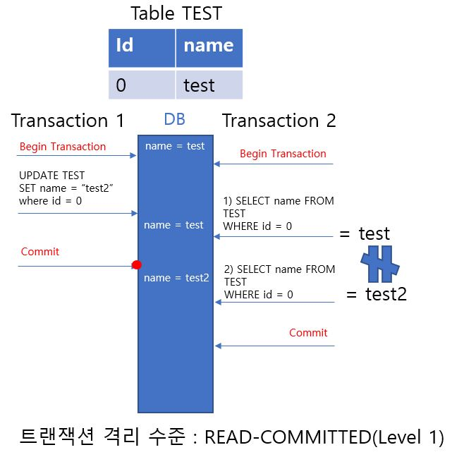

# JWT

> RFC 7519 웹 표준으로 지정이 되어있고 JSON 객체를 
사용해서 토큰 자체에 정보들을 저장하고 있는 Web Token

 

## 구성

- Header
    - Signature를 해싱하기 위한 알고리즘 정보
- Payload
    - 시스템에서 실제로 사용될 정보에 대한 내용(client - server )
- Signature
    - 토큰의 유효성 검증을 위한 문자열

 

## JWT의 장단점

- 중앙의 인증서버, 데이터 스토어에 대한 의존성 X, 시스템 수평 확장 유리
- Base64 사용 > URL, Cookie, Header 모두 사용 사능

 

- Payload의 정보가 많아지면 네트워크 사용량 증가
- 토큰이 클라이언트에 저장되므로 서버에서 클라이언트의 토큰을 조작할 수 없음

 

---

# JPA

 

## JPA 사용 이유

 

Application은 JAVA, 객체지향 언어로 개발하는데 데이터는 RDB에 저장한다면 패러다임의 불일치가 발생
 

~~***패러다임 불일치 : OOP와 RDB의 데이터 표현방식과 다루는 방법이 달라 일어나는 현상***~~

객체를 RDB에 저장하기 위해 객체를 SQL로 변환해야한다. 
이 변환과정을 개발자가 해야하는데 이 과정이 굉장히 불편함 ~~MyBatis~~

 

JPA는 이 과정을 대신해준다.

 

## 영속성 컨텍스트

> Entity를 영구 저장하는 환경(논리적 개념)

 

애플리케이션과 DB 사이에서 객체를 보관하는 가상의 DB 같은 역할을 해줌. 

 
영속성 컨텍스트의 기능
- 1차 캐시
- 동일성 보장
- 쓰기 지연(flush?)
- 변경 감지(snap shot)
- 지연 로딩과 즉시 로딩

 

. . . 
JPA는 __트랜잭션 격리 수준__ 을 2단계(0~3) 아래로 낮춰도 JPA 애플리케이션에서 2단계까지 보장해준다고 한다. 
*이게 동일성 보장?

---

<h2 id = "Isolation Level">트랜잭션 격리 수준</h2>

 
직렬성은 프로그래머가 트랜잭션의 코드를 작성할 때에 __동시성을 고려하지 않을 수 있도록 해주는__ 유용한 개념이다. 
모든 트랜잭션이 각자 혼자 수행되었을 때에 데이터베이스의 일관성을 깨지않는다면, 
직렬성은 이들을 동시에 수행하여도 일관성을 유지할 수 있다는 것을 보장한다. 
 

SQL 표준에 지정된 고립성 수준

1. Read Uncommited (Level 0)
> - 트랜잭션 수행 중이거나 __아직 commit 되지 않은 데이터를 다른 트랜잭션에서 Read 하는 것을 허용한다.__ 
> - Dirty Read, Non Repeatable Read, Phantom Read 발생 가능

 

2. Read Commited (Level 1)
> - 트랜잭션 수행이 완료되고 __commit 된 데이터만 다른 트랜잭션에서 Read__ 하도록 허용 
> - Non Repeatable Read, Phantom Read 발생가능 
> - 일반적으로 Default로 설정하는 레벨(DBMS)

 

3. Repeatable Read (Level 2)
> - 특정 트랜잭션에서 __읽고 있는 데이터는 다른 트랜잭션에서 수정/삭제가 불가능__ 하다. 
> - __데이터 삽입은 가능하다.__ 
> - Phantom Read 발생가능 

4. Serializable (Level 3)
> - 특정 트랜잭션에서 __읽고 있는 데이터는 다른 트랜잭션에서 수정/삭제/삽입 모두 불가능__ 하다.
> - 모든 이상 현상 방지 가능 
> - 성능은 하락함 

 

위의 모든 고립성 수준은 추가적으로 Dirty Write를 허용하지 않는다. 
= commit 또는 중단되지 않은 다른 트랜잭션이 기록한 데이터 항목에 대한 기록을 허용하지 않는다.

 

## 이상현상

 

| 이상 현상               | 설명                                                                 |
|---------------------|--------------------------------------------------------------------|
| Dirty Read          | 어떤 트랜잭션에서 아직 __실행이 끝나지 않은 트랜잭션에 의한 변경사항__ 을 보게 되는 경우               |
| Non Repeatable Read | 어떤 트랜잭션이 같은 쿼리를 2번 실행하는데 __그 사이에 다른 트랜잭션이 수정/삭제를 하여__ 다른 값이 나오는 경우 |
| Phantom Read        | 어떤 트랜잭션이 같은 쿼리를 2번 실행하는데 __그사이에 없던 레코드가 추가된 경우__                   |

 

- Dirty Read 

 

- Non Repeatable Read 

 

- Phantom Read 

 

...

*지연 로딩과 즉시 로딩

---

## 실습 내용

간단한 모든 회원 조회 API 구현

스켈레톤 코드에 추가

 
컨트롤러

 
서비스

 
결과(swagger)

---

## 인증(Authentication)과 인가(Authorization)

인증이란?
> 보호된 리소스에 접근하는 것을 __허용하기 이전에__ 등록된 유저의 신원을 입증하는 과정
. . . 신원이 올바른지 검증하기 위한 과정
 

인가란?
> 요청된 리소스에 접근할 수 있는 __권한이 있는 인증된__ 유저인지 입증하는 과정
. . . 신원을 기반으로 인증된 주체가 특정 리소스에 접근할 수 있는 권한을 주는 것.
 

. . .  인증 - 접근 허용 - 인가 - 리소스 접근 권한

 

웹에서의 인증과 인가
- 요청 헤더
- 세션, 쿠키
- 토큰
- __OAuth__

## OAuth란?
OAuth는 인터넷 사용자들이 비밀번호를 제공하지 않고 다른 웹사이트 상의 자신들의 정보에 대해 웹사이트나 애플리케이션의 __접근 권한을 부여__ 할 수 있는 공통적인 수단으로서 사용되는, 접근 위임을 위한 개방형 표준이다.

 

OAuth의 장점
 

| 대상  | 장점                                                    |
|-----|-------------------------------------------------------|
| 사용자 | 서비스에 ID/PW를 안 알려준다. 원할 때 엑세스 토큰의 권환 취소 가능          |
| 서비스 | 유저의 엑세스 토큰만 보유하면 된다.  사용자의 ID/PW없이도 허가 받은 API 접근가능 |

__AccessToken__  
아이디, 비밀번호가 아닌 서비스가 가진 기능을 부분적으로 허용해준다. 
OAuth를 통해서 획득하고 토큰을 통해 데이터를 가져오고, 수정, 삭제 기능을 수행 가능

 

OAuth 참여자

- Resource Server
  - Client가 제어하고자 하는 자원을 보유하고 있는 서버
  - Google, FaceBook 등

     

- Resource Owner
  - Client가 제공하는 서비스를 통해 로그인하는 유저

     

- Client
  - Resource Server에 접속해서 정보를 가져오고자 하는 클라이언트(Application)

 

---

## 등록
 

~~서비스마다 상이하지만 공통적인 부분~~

Client ID
- 우리가 만들고있는 App을 식별하는 ID
- 노출 가능

Client Secret
- Cliend ID에 대한 비밀번호
- 절대로 노출되면 안된다

Authorized redirect URIs
- 리소스 서버가 권환을 부여하는 과정에서 Authorized code를 준다. 이 것을 전달받을 리다이렉트 주소
- 등록되지 않은 리다이렉트 주소에서 오는 요청은 인증을 거부함

. . . 등의 정보를 등록한다.

 

---
## Resource Owner의 승인

1. 링크 클릭(ex. login with google)
2. 링크
   
   리다이렉트를 통해 3번으로 이동
3. 로그인이 되어 있으면(안 되어있으면 로그인 요청) 정보를 확인한다(redirect url과 client id 등)
4. 어떤 권한(scope)을 허용할 것이냐?
5. 허락 한다.
   Resource Server에서 Resource Owner가 어떤 기능을 어떤 scope에 대한 작업을 동의하였다. 를 기록한다.

---

## Resource Server의 승인

1. Resource Owner에게 authorization code(임시 비밀번호)를 전송  (redirect URL에 담아서,ex https://test/callback?__code=3__
   )
2. Client에게 authorization code가 전송된다
3. Client가 Resource Server에 직접 접속, 
   authorization code와 client id, client secret 전송
4. Resource Server에서 자신의 기록과 일치하는지 비교한다.

---

## Access Token 발급

1. (authorization code 값을 지운다) accessToken을 발급하고 Client에 응답한다.
2. Client는 내부적으로 토큰을 저장한다.

---

## Refresh Token

accessToken에는 수명이있다. 수명이 다 할시에 재발급을 받아야한다. 
위의 Resource Owner의 승인, Resource Server의 승인, Access Token 발급 과정을 반복하지 않기 위해 사용하는 방법이다.

 

참고: RFC6749 https://datatracker.ietf.org/doc/html/rfc6749

*상위 과정들에 나오는 Resource Server은 참고 사진의 Resource Server와 Authorization Server을 합친 것*
 

*위 참고 사진의 A 과정은 Resource Server의 승인 과정의 3번에 해당하는 것 같다*

 

---

# WebRTC

 

## NAT

 
네트워크 주소변환

> IP 패킷에 있는 출발, 목적지의 IP 주소와 TCP/UDP 포트 숫자 등을 바꿔 재기록하면서 네트워크 트래픽을 주고 받게하는 기술

 

왜 사용하는가?
- IP 주소 절약
  - 하나의 공인 IP 주소를 통해 여러대의 호스트가 인터넷에 연걸 가능. 
    = 하나의 공유기에 여러 대의 컴퓨터 연결, 인터넷 공유기에 NAT기능 탑재되어있음.
- 보안
  - NAT 동작의 특성상 IP를 숨길 수 있는 기능이 있다. 
    외부로 트래픽이 나갈 때 private IP에서 public IP로 바뀌므로 내부 네트워크를 보호할 수 있다.

     

*출처 : 위키피디아*

## WebSocket

 

브라우저와 서버의 통신 = HTTP 

브라우저 -> 서버 Request 

서버 -> 브라우저 Response 

HTTP는 Stateless이다. 

request - response 이후에 통신은 끊김. 

request 없이는 response 도 없다 

-> 서버에서 브라우저로 그냥 response를 보낼 수 없다. 

실시간으로 데이터를 주고 받을 수 없음. 
웹 소켓 등장

request - response -> open - close (connection) 

 

웹 소켓 서버에 접속하여 데이터 전송시 연결된 다른 사용자에게 전달된다. 

사용자가 많아지면 서버에 부하가 걸린다(메모리) 

-> __브라우저와 서버가 아닌, 브라우저와 브라우저끼리 연결하자..! = WebRTC__

 

WebRTC란?

 

> Web Real-Time Communication 
> 웹 app 및 사이트들이 별도의 SW 없이 __중간자 없이__ 텍스트, 오디오, 영상 등의 데이터를 브라우저 끼리 주고 받을 수 있게 만든 기술

 

---

