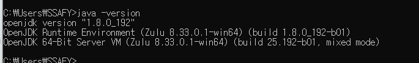
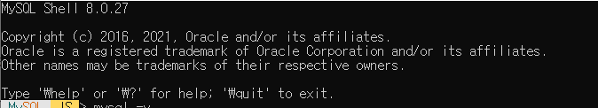
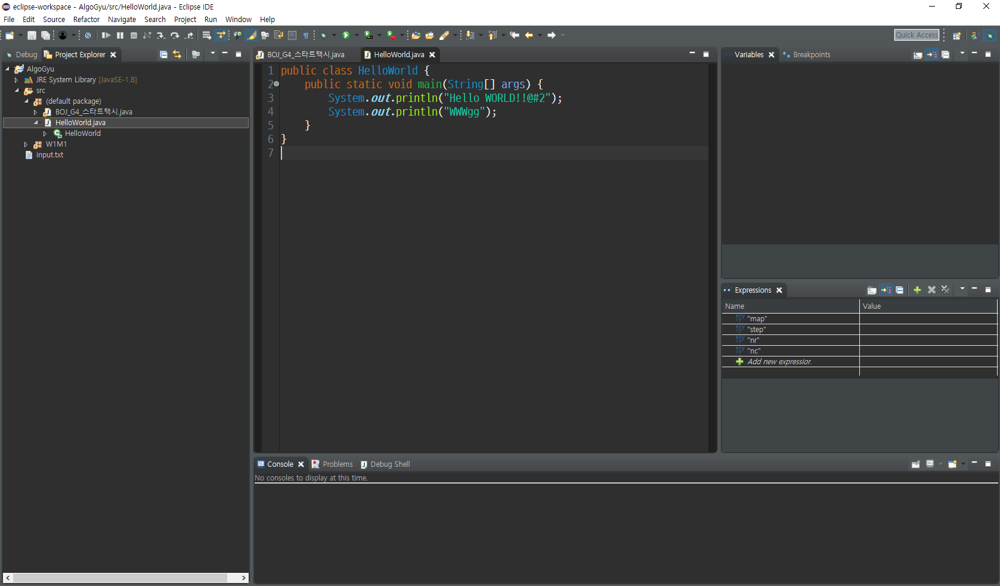
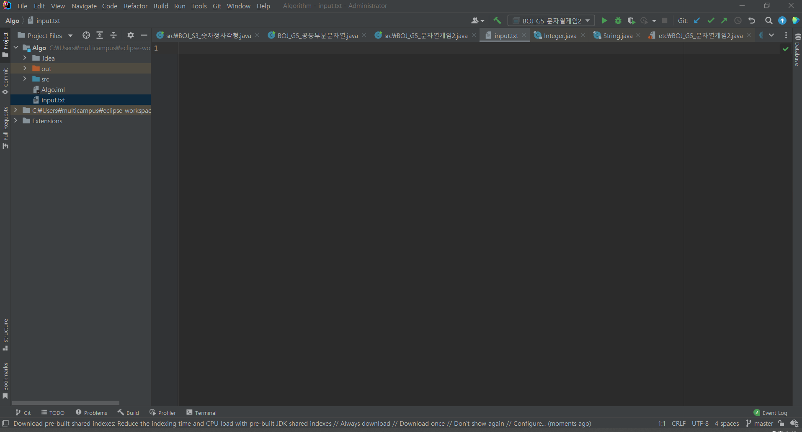
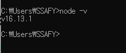
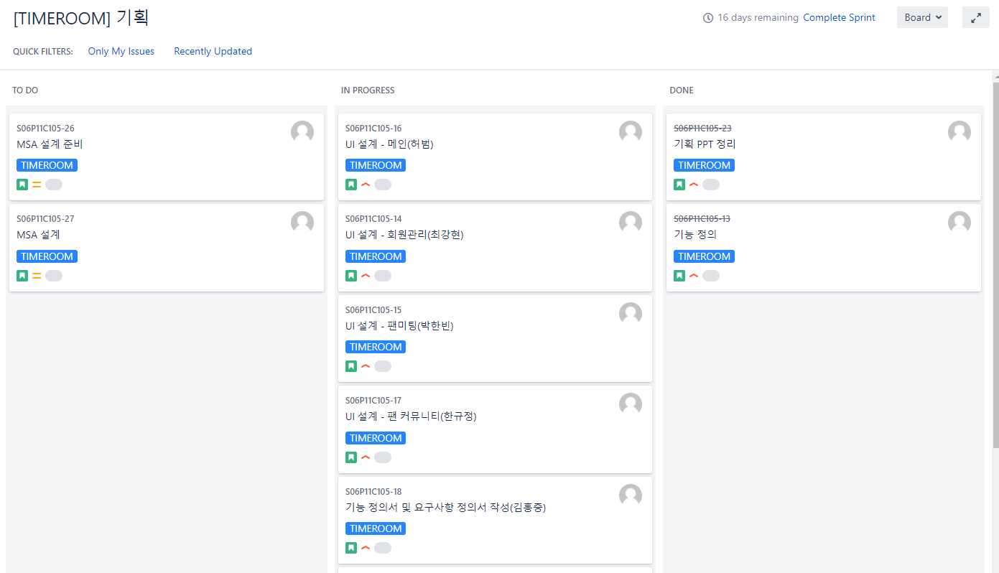
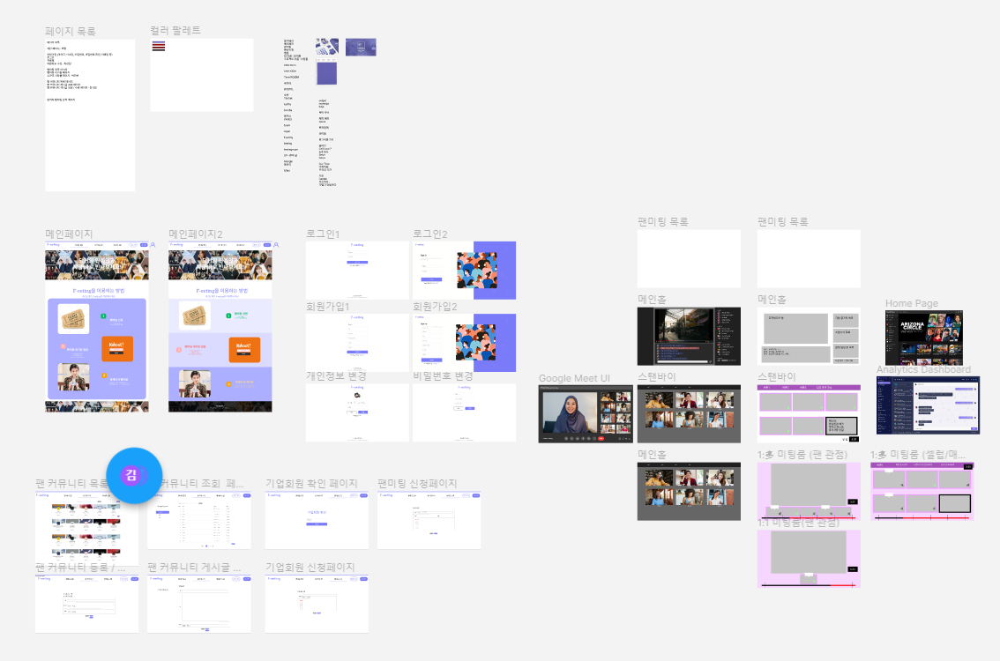
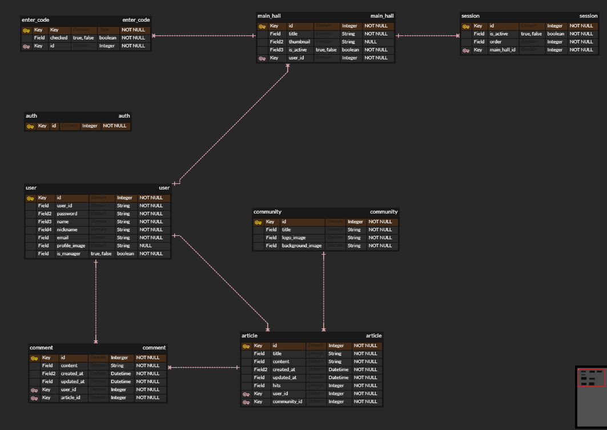

### Sub PJT 1


##### 1 개발환경 설정 

Java 설치



MySQL 설치



Eclipse IDE 설치



IntelliJ 설치




Node.js 설치




##### 2 추가 공부사항

###### 세션

1. 사용자가 로그인을 성공하면 세션을 발행한다.

2.  그 세션 서버메모리에 저장하고 브라우저로 보내 쿠키에도 저장한다.

3. 인가(특정리소스 접근)가 필요한 요청을 보낼때 세션값을 서버에 같이 보낸다.

4. 서버는 메모리에 저장된 값과 세션값을 비교해서 체크하여 인증한다.

   

 단점으로는 사용자가 동시에 몰리게 되면 서버 메모리가 부족할 수    있다. 또한 서버가 꺼지게 되면 서버 메모리에 있는 세션들이 모두 날라갈 수 있다.


###### JWT

1. 사용자 로그인이 성공하면 JWT를 발행한다.
2. 유저가 요청을 할때 토큰을 헤더에 포함해서 전달
3. 서버는 해당 토큰이 유효한지 체크하여 인증한다.


단점으로는 토큰에 담기는 정보가 많아질수록 토큰의 길이가 늘어나 네트워크에 부하를 줄 수 있다.


```java
    @PostMapping("/user/login")
    public String login(@RequestBody SignupRequestDto requestDto) {
        User user = userRepository.findByUsername(requestDto.getUsername())
                .orElseThrow(() -> new IllegalArgumentException("가입되지 않은 유저입니다."));
        if (!passwordEncoder.matches(requestDto.getPassword(), user.getPassword())) {
            throw new IllegalArgumentException("잘못된 비밀번호입니다.");
        }
        return jwtTokenProvider.createToken(user.getUsername(), user.getRole());
    }
```

UserController 부분

```java
@RequiredArgsConstructor
public class JwtAuthenticationFilter extends GenericFilterBean {

    private final JwtTokenProvider jwtTokenProvider;

    @Override
    public void doFilter(ServletRequest request, ServletResponse response, FilterChain chain) throws IOException, ServletException {
        // 헤더에서 JWT 받아옴
        String token = jwtTokenProvider.resolveToken((HttpServletRequest) request);
        // 유효한 토큰인지 확인
        if (token != null && jwtTokenProvider.validateToken(token)) {
            // 토큰이 유효하면 토큰으로부터 유저 정보를 받아옴
            Authentication authentication = jwtTokenProvider.getAuthentication(token);
            // SecurityContext 에 Authentication 객체를 저장
            SecurityContextHolder.getContext().setAuthentication(authentication);
        }
        chain.doFilter(request, response);
    }
}
```

JwtAuthenticationFilter 부분


###### 3 공통프로젝트 설계



[JIRA 이슈 및 일정 관리]



[UI 프로토타입]



[ERD 설계(진행중)]

- 서비스 설명 : 주요 기능일정 제한 시간 안에 소규모 그룹의 팬들과 셀럽이 소통할 수 있는 실시간 팬미팅 서비스로서 주로 온라인 팬미팅을 열고자하는 연예 소속사를 타겟으로 하는 B2B 서비스 
- 주요 기능: 실시간 팬미팅팬 대기방 기능소규모 그룹 미팅방 기능 미팅방별 제한 시간 설정과 사용자 자동이동 기능 팬 커뮤니티자유게시판 기능 
- 주요 기술 스택: Spring Boot, Vue, MySQL, Docker, Jenkins, Jira
- 역할 :김홍중(팀장) : Back-end  박한빈 : Front-end  오지훈 : Back-end  최강현 : Back-end  한규정 : Back-end  허범 : Front-end
