# 웹(웹 기술) 프로젝트

## 카테고리

| Application | Domain | Language | Framework |
| ---- | ---- | ---- | ---- |
| :white_check_mark: Desktop Web | :black_square_button: AI | :white_check_mark: JavaScript | :white_check_mark: Vue.js |
| :black_square_button: Mobile Web | :black_square_button: Big Data | :black_square_button: TypeScript | :black_square_button: React |
| :black_square_button: Responsive Web | :black_square_button: Blockchain | :black_square_button: C/C++ | :black_square_button: Angular |
| :black_square_button: Android App | :black_square_button: IoT | :black_square_button: C# | :black_square_button: Node.js |
| :black_square_button: iOS App | :black_square_button: AR/VR/Metaverse | :black_square_button: Python | :black_square_button: Flask/Django |
| :black_square_button: Desktop App | :black_square_button: Game | :white_check_mark: Java | :white_check_mark: Spring/Springboot |
| | | :black_square_button: Kotlin | |

<br>

# 👭FANTALK 👫(by TIMEROOM)
> 코로나 19로 인해 오프라인 팬미팅을 하지 못하는 기획사와 팬들을 위한 1:1 실시간 팬미팅 서비스
>
> [배포링크](https://i6c105.p.ssafy.io)
>
> 2022.01.10 ~ 2022.2.18 (약 6주)

<br>

## 📌목차

- [프로젝트 소개](#프로젝트-소개)
  - [기획 의도](#기획-의도)
  - [팀원 및 역할](#팀원-및-역할)
  - [서비스 소개](#서비스-소개)
  - [개발 그라운드 룰](#개발-그라운드-룰)
- [프로젝트 디자인](#프로젝트-디자인)
  - [Service Architecture](#service-architecture)
  - [UI Design](#ui-design)
  - [ERD Design](#erd-design)
  - [REST API](#rest-api)
- [주요 기능](#주요-기능)
  - [포팅 매뉴얼](#포팅-매뉴얼)
  - [주요 기능 목록 및 설명](#주요-기능-목록-및-설명)

<br>

## 프로젝트 소개

### 기획 의도

- **코로나 19 확산으로 인한 오프라인 팬미팅의 대체재로써 온라인 팬미팅이 필요!**

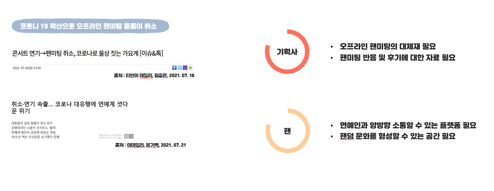

- **팬미팅 니즈를 중심으로한 STP 분석**

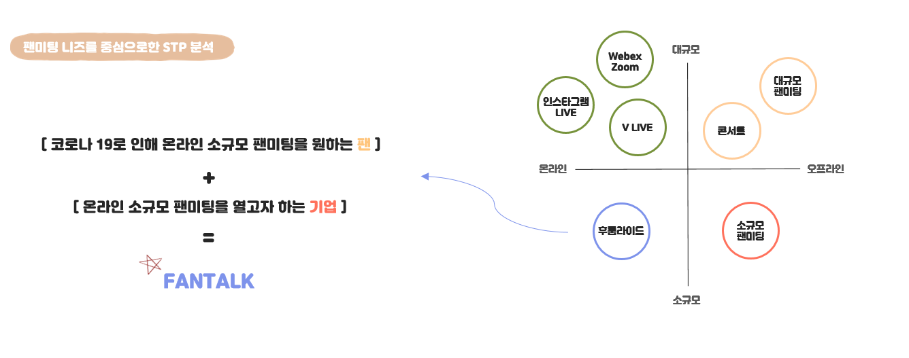

<br>

### 팀원 및 역할

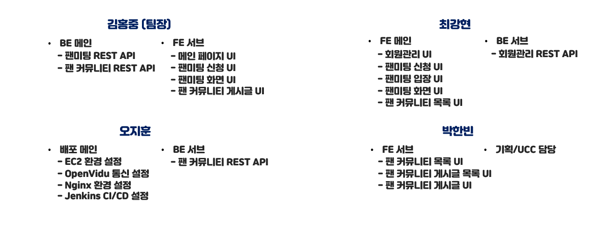

<br>

### 서비스 소개

#### 📡 연예인과의 '1:1 실시간 팬미팅'

- **사전에 부여받은 입장코드를 통해 연예인과 1:1 실시간 팬미팅**

#### 📒 팬들끼리의 소통창구 '팬 커뮤니티'

- **팬미팅 후기 공유 및 같은 연예인을 좋아하는 팬들을 위한 팬 커뮤니티**

<br>

### 개발 그라운드 룰

#### 🌿 Git branch 전략

- **master** : 라이브 서버에 제품으로 출시되는 브랜치
- **name** : 현재 작업하고 있는 팀원의 브랜치
  - ex) hongjung
- **hotfix** : master 브랜치에서 발생한 버그를 수정하는 브랜치
- **commit message rule**
  - '날짜 기능명-작업종류 [간단한 작업 내용]'
    - ex) '0119 signup-create [...]'
    - ex) '0120 signup-hotfix [...]'
- 한번 merge된 브랜치는 삭제하고 재생성해서 작업

#### 🌱 BE

- SOLID를 기반으로 객체 지향 설계 추구
- DAO는 JPA Repository를 사용, DTO를 만들어 Entity로 직접 API 통신을 송수신 하지 않음
- 주석을 통해 개발 내용을 공유

#### 🌺 FE

- 사용자 경험을 최우선시함
- 일관된 색과 디자인을 추구

<br>

## 프로젝트 디자인

### Service Architecture

>주요 기술 스택
>
>실시간 영상 서비스의 빠른 구축을 위해 WebRTC, Kurento, Stun, Turn 등이 결집된 오픈소스 플랫폼 'OpenVidu'를 이용
>
>OpenVidu의 카메라 권한이 Https에서만 허용되기 때문에 'Nginx'를 이용하여 SSL 설정
>
>개발의 생산성을 위해 'Jenkins'를 이용하여 자동 빌드 및 배포를 실행
>
>'Jira'를 이용하여 애자일 개발을 지향하려고 노력(스프린트 주기 설정, 백로그 관리 등)

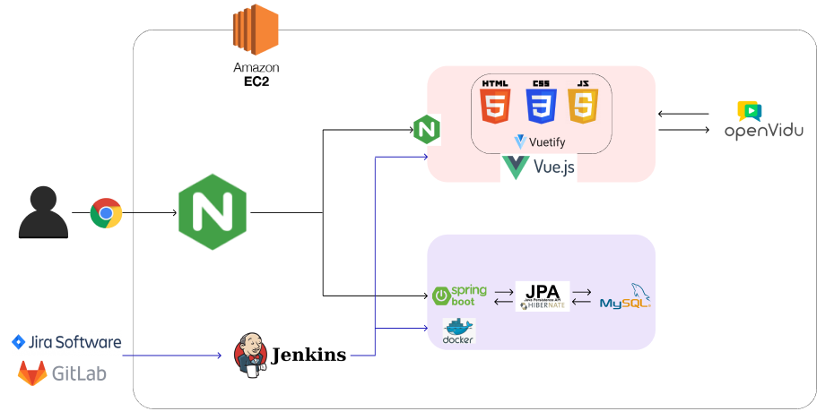

<br>

### UI Design

#### 🎨 Color Palette

- **22년 올해의 팬톤 컬러인 '베리 페리'를 중심으로 Color Palette 설계**

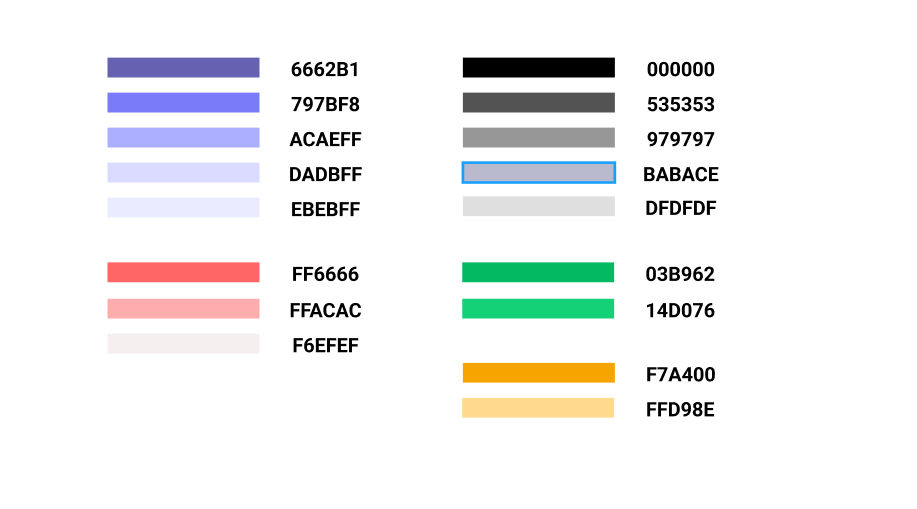

#### 📐 UI

- **Figma를 이용하여 UI Design**

- **메인 페이지 & 회원 관리 페이지**

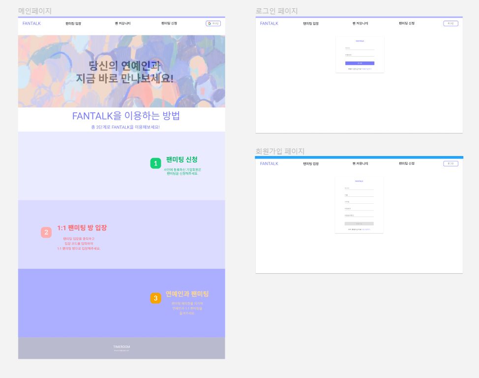

- **팬 커뮤니티 페이지**

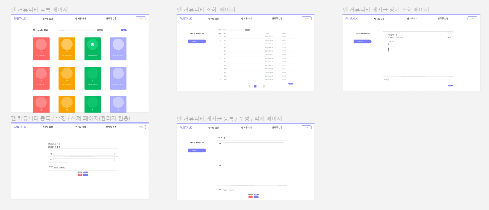

- **팬미팅 신청 페이지**

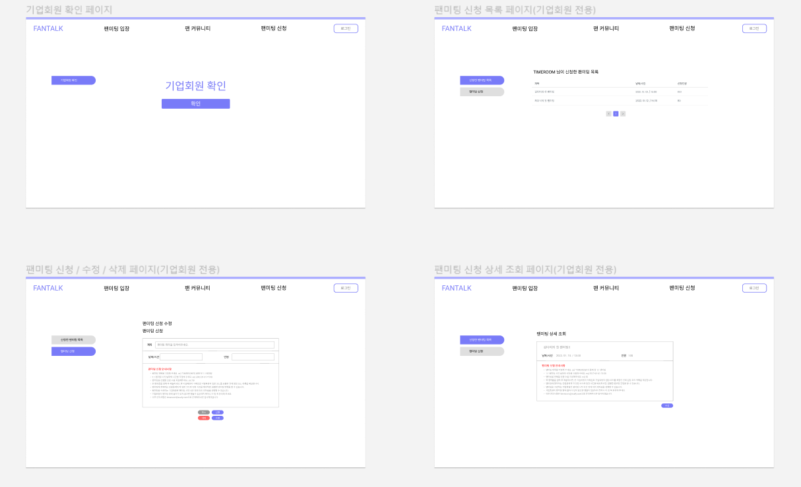

- **팬미팅 페이지**

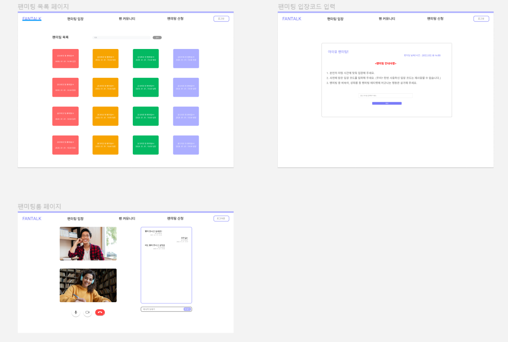

<br>

### ERD Design

- **ERD Cloud를 이용하여 ERD 설계**

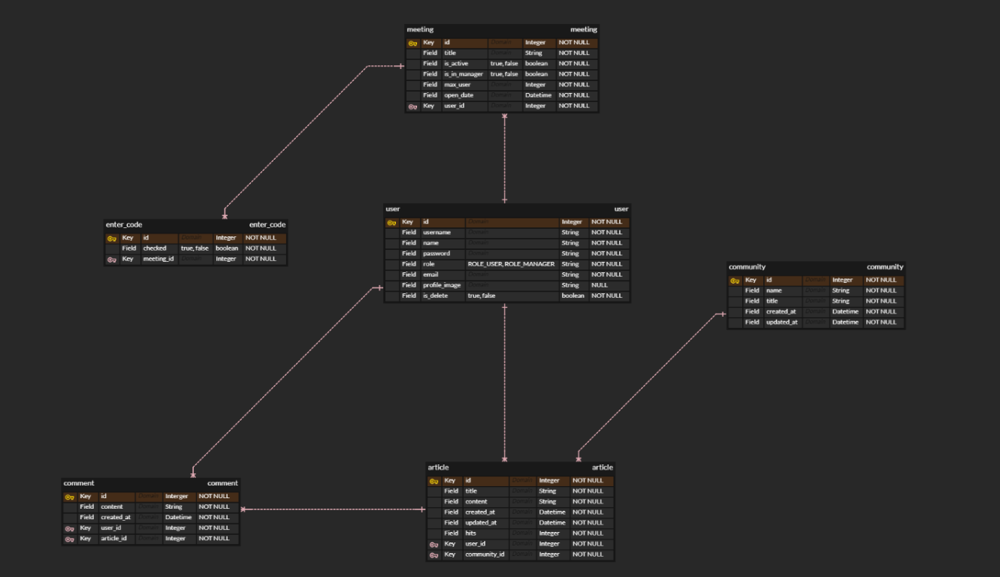

<br>

### REST API

- **Swagger을 이용하여 REST API 설계 및 정리**

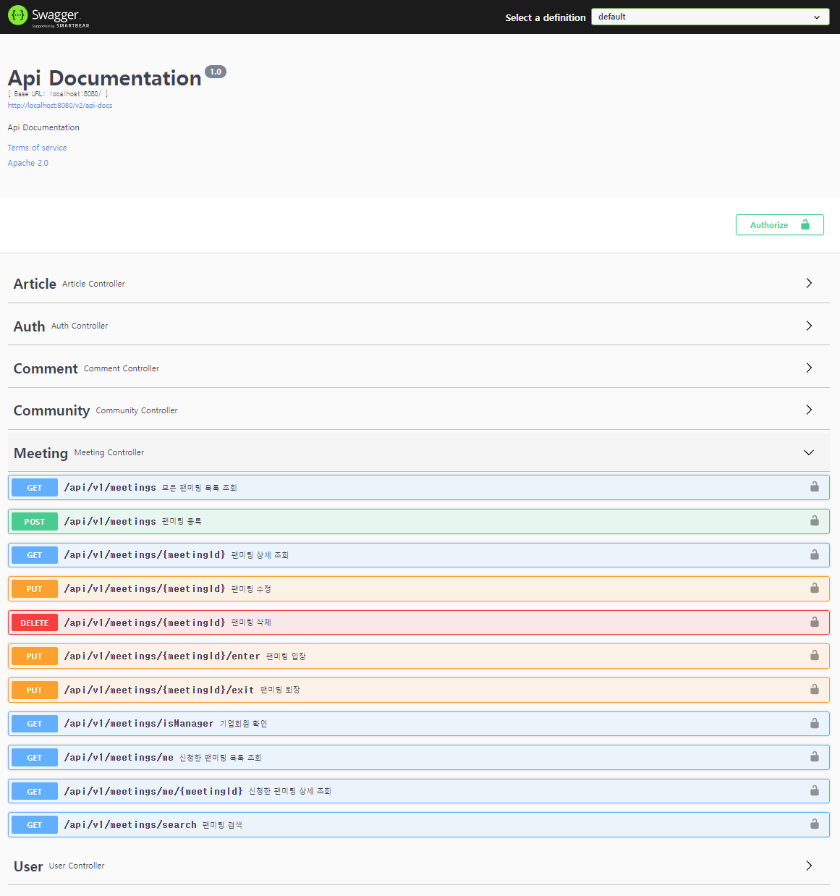

<br>

## 주요 기능

### 포팅 매뉴얼

- [포팅 매뉴얼](https://lab.ssafy.com/s06-webmobile1-sub2/S06P12C105/-/tree/master/exec)
- 설치 가이드

````
#git clone

#backend
cd backend-java
sudo chmod +x ./gradlew
sudo ./gradlew clean build
cd ..
sudo docker run -d --name timeroom-backend --network host timeroom/backend-spring-boot-docker

# openvidu-server
cd /opt/openvidu
/sudo openvidu start
```
````

- 포트 설정

```
ufw allow ssh
ufw allow 80/tcp
ufw allow 443/tcp
ufw allow 3478/tcp
ufw allow 3478/udp
ufw allow 5044/tcp
ufw allow 9200/tcp
ufw allow 40000:65535/tcp
ufw allow 40000:65535/udp
ufw allow 9090/tcp # 젠킨스
ufw enable
```

<br>

### 주요 기능 목록 및 설명

#### 🎈 팬 커뮤니티

- 올바른 팬덤 문화 형성과 기획사의 개입 최소화를 위해 FANTALK 운영진이 생성, 수정, 삭제를 관리
- 각 게시글과 댓글에 대한 수정, 삭제는 작성한 회원만 보이고 가능

#### 🎭 1:1 실시간 팬미팅

- 사전에 권한을 받은 기업회원만 팬미팅 신청 가능(FANTALK 운영진이 따로 권한을 부여)
- 팬미팅은 해당 팬미팅을 신청한 기업회원만 수정, 삭제 가능
- 팬미팅 신청이 완료되면 기업회원에게 입장 코드 목록을 제공 (FANTALK 운영진이 따로 메일을 통해 전달)
- 팬미팅은 기업회원이 먼저 입장한 후에 일반회원이 입장 가능
- 일반회원은 현재 진행 중인 팬미팅에는 입장이 불가능
- 일반회원은 한번 사용한 입장코드 재사용 불가
- OpenVidu API(Signal)를 이용하여 실시간 채팅 가능


