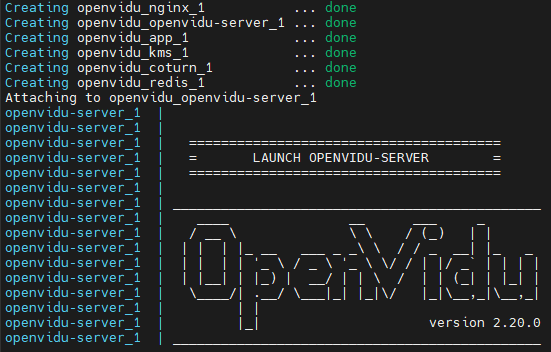
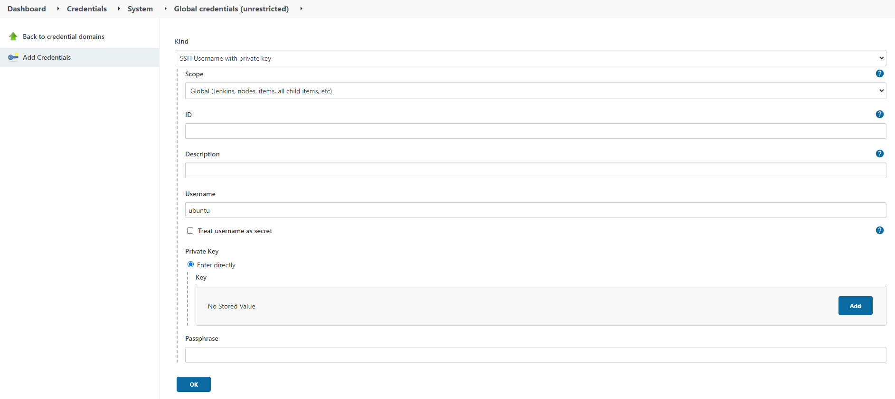

**※ DB  덤프 파일과 시연 시나리오는 동일 디렉토리에 따로 만들어 놓았습니다. ※**

## 빌드 및 실행

***Jenkins를 사용하여 자동으로 빌드 및 배포가 되도록 설정이 되어있습니다.***
<br>

***수동 배포는 아래에서 다루겠습니다***

<br>

### 시스템 아키텍처


<br>

### 기술 스택 및 버전
|  설치 목록  | version
|-----------|--------------|
| Ubuntu | 20.04 LTS|
| Vue | 2.6.11|
| Vuetify |2.4.0|
| SpringBoot | 2.4.5|
| MySQL | 8.0.27|
| Nginx | 1.18.0 |
| Docker | 20.10.12|
| Docker-Compose | 1.29.2|
| Jenkins | 2.319.3|
| Openvidu | 2.20.0|
|Node | 16.13.2|
|Npm|8.3.2|
<br>

---
<br>

## 수동 배포

## 1. EC2 설정

**방화벽 설치 및 활성화**

```
sudo apt install ufw # 설치
sudo ufw enable # 활성화
```
기본적으로 인바운드에 대한 모든 패킷은 거부,<br>
아웃바운드에 대한 패킷은 모두 허용이 default입니다.

<br>

**UFW 허용**
```
ufw allow ssh
ufw allow 80/tcp
ufw allow 443/tcp
ufw allow 3478/tcp
ufw allow 3478/udp
ufw allow 5044/tcp
ufw allow 9200/tcp
ufw allow 40000:65535/tcp
ufw allow 40000:65535/udp
ufw allow 9090/tcp # 젠킨스
ufw enable
```
**관리자 권한으로 실행합니다.**

<br>

**openvidu docs 참고**


<br>


## 2. Openvidu 설치
> Openvidu Docs : https://docs.openvidu.io/en/stable/
>
> **/opt 에 설치합니다**
> ```
> sudo su
> cd /opt
> curl https://s3-eu-west-1.amazonaws.com/aws.openvidu.io/install_openvidu_pro_latest.sh | bash
> ```
>
> **설치 후에 openvidu-server의 설정을 바꿔 줍니다.**
> ```
> cd /opt/openvidu
> sudo vi .env
> ```
> [.env]
>
> 
>
> ```
> DOMAIN_OR_PUBLIC_IP=i6c105.p.ssafy.io
> OPENVIDU_SECRET=MY_SECRET
> CERTIFICATE_TYPE=letsencrypt
> LETSENCRYPT_EMAIL=dhwlgns7028@naver.com
> HTTP_PORT=8081
> HTTPS_PORT=8443
> ```
> . . 위와 같이 세팅합니다.<br>
> ESC +  :wq + Enter<Br>

<br>

## 3. Openvidu 시작하기
>/opt/openvidu 에서 openvidu 쉘 스크립트를 사용합니다.<br>
>
>## ** 주의사항 : sudo su로 변경 후, 혹은 sudo를 사용하여 실행해야 합니다.
>
>**openvidu 실행**
>
>```
>sudo ./openvidu start # 실행
>sudo ./openvidu restart # 재실행
>sudo ./openvidu stop # 중지
>```
>**실행 화면**
><br>
>
>
>
><br>
>
>
>터미널이 종료된 후에도 서버를 살려두기 위해 tmux를 사용하였습니다.
>
><br>
>
>**tmux 설치**
>```
>sudo apt-get install
>```
>**새로운 세션 생성**
>```
>tmux new -t 세션 이름 
>```
>**새션 접근**
>```
>tmux attach -t 세션 이름
>```
>세션에서 나올 시엔 [Ctrl + b] 를 누른 후에 D<br>
>세션을 종료하고 싶을 땐 [Ctrl + d]를 누르시면 됩니다.

<br>

## 4. 서비스 빌드하기

>깃 클론
>```
>git clone https://lab.ssafy.com/s06-webmobile1-sub2/S06P12C105.git
>```
>
><br>
>
>**backend-java 폴더의 gradle 빌드**
>```
>cd backend-java
>sudo chmod +x ./gradlew
>sudo ./gradlew build
>```
>
>프론트 정적 파일 : backend-java/dist
>백 jar 파일 : backend-java/build/libs
>에 생성된다.
><br>
>
>정적 파일을 서비스화하기 위해서는 웹 서버가 필요합니다.<br> 
>저희 팀은 nginx를 사용합니다.<br>
>그리고 백 엔드 서버는 도커 컨테이너로 실행하였습니다.
><br>
><br>
>
>**프로젝트 최상위 폴더의 Dockerfile**
>```
>FROM openjdk:8-jdk-alpine
>ARG JAR_FILE=/backend-java/build/libs/*.jar
>COPY ${JAR_FILE} app.jar
>ENTRYPOINT ["java","-jar","/app.jar"]
>```
>**도커 이미지 빌드**
>```
>docker build -t timeroom/backend-spring-boot-docker .
>```
>docker images 명령어 실행시 이미지를 확인할 수 있습니다.<br>
><br>
>
>**도커 컨테이너 실행**
>```
>sudo docker run -d --name timeroom-backend --network host timeroom/backend-spring-boot-docker 
>```
>-d 옵션을 사용하여 백 그라운드에서 실행되도록 하였습니다.
>- docker logs timeroom-backend 명령어로 로그 확인이 가능합니다.
>
><br>
>
>tomcat 기본 포트인 8080을 사용하였습니다. <br>
>- --network host 옵션을 사용하여 호스트와 네트워크를 함께 사용합니다.<br>
>
><br>
>
>docker ps 명령어로 실행중인 컨테이너 정보를 확인할 수 있습니다.<Br>
>


<br>

## 5. Nginx 설정 및 ssl(tsl) 
>### Nginx
><br>
>
>openvidu 사용(카메라 권한)을 위해 https 프로토콜을 사용하였습니다.<br>
>https 적용과 정적 파일을 서비스화하기 위해 nginx를 사용하였습니다.<Br>
>
>nginx 사용법
>```
>sudo service nginx start # 서비스 시작
>sudo service nginx stop # 서비스 중지
>sudo service nginx restart # 서비스 재시작
>sudo nginx -t # nginx 설정 문법 검사
>```
>/etc/nginx/nginx.conf 파일에서 nginx 의 설정을 확인할 수 있습니다. <br>
>해당 파일에서 /etc/nginx/sites-enabled 디렉토리의 설정 정보를 include 하는데,<br> 
>/etc/nginx/sites-available 의 파일들과 심볼릭 링크가 설정되어 있어서 /etc/nginx/sites-available/default 파일을 수정하시면 됩니다.
>
><br>
>
>/etc/nginx/sites-available/default
>변경 후에 
>```
>sudo nginx -t
>sudo service nginx restart
>```
>문법을 확인하고 재시작합니다.
>
><br>
>
>저희의 default 파일 설정입니다.
>```
>upstream backend{
>	server localhost:8080;
>}
>
>server {
>
>
>	server_name i6c105.p.ssafy.io www.i6c105.p.ssafy.io;
>
>	location /{
>		root /var/lib/jenkins/workspace/TimeRoomDeploy/backend-java/build/resources/main/dist;
>	        try_files $uri $uri/ /index.html;
>	}
>
>
>	access_log /var/log/nginx/access.log;
>	error_log /var/log/nginx/error.log;
>
>listen [::]:443 ssl ipv6only=on; # managed by Certbot
>	listen 443 ssl; # managed by Certbot
>	ssl_certificate /etc/letsencrypt/live/i6c105.p.ssafy.io/fullchain.pem; # managed by Certbot
>	ssl_certificate_key /etc/letsencrypt/live/i6c105.p.ssafy.io/privkey.pem; # managed by Certbot
>	include /etc/letsencrypt/options-ssl-nginx.conf; # managed by Certbot
>	ssl_dhparam /etc/letsencrypt/ssl-dhparams.pem; # managed by Certbot
>
>
>	## backend
>	location /api {
>           proxy_pass http://backend/api;
>           proxy_redirect off;
>           charset utf-8;
>
>           proxy_set_header X-Real-IP $remote_addr;
>           proxy_set_header X-Forwarded-For 
>           $proxy_add_x_forwarded_for;
>           proxy_set_header X-Forwarded-Proto $scheme;
>           proxy_set_header X-Forwarded-Host $host;
>           proxy_set_header X-Forwarded-Port $server_port;
>		        proxy_set_header X-NginX-Proxy true;
>		        proxy_http_version 1.1;
>		        proxy_set_header Connection "";
>		        proxy_set_header    Upgrade $http_upgrade;
>		        proxy_set_header Connection "upgrade";
>	}
>
>}
>
>#redirect
>server {
>if ($host = i6c105.p.ssafy.io) {
>   return 301 https://$host$request_uri;
>} # managed by Certbot
>
>
>   listen 80;
>   listen [::]:80;
>
>   server_name i6c105.p.ssafy.io www.i6c105.p.ssafy.io;
>return 404; # managed by Certbot
>}
>```
>
>- server
>   - server_name에 설정한(i6c105.p.ssafy.io)에 오는 요청을 처리합니다.
>
>   - root에 프론트 엔드의 정적 파일이 존재하는 폴더로 설정합니다.
>   - https 설정을 하고 http를 https로 리다이렉트 해주도록 설정합니다<br>
>       . . . Certbot 자동 생성
>- upstream
>   - 백 엔드 서버가 사용하는 8080포트로 설정합니다.(변경 가능).
>
>   - 8080 포트를 사용중인 백 엔드 서버로 매핑됩니다.
>- backend
>   - location /api 부분을 통해<br> /api로 들어오는 요청(백 엔드)에 대하여 localhost:8080으로 매핑합니다.
>
><br>
>
>nginx에 대한 로그는 /var/log/nginx/ 에서 확인이 가능합니다.<br>
>
>```
>sudo vi /var/log/nginx/access.log
>sudo vi /var/log/nginx/error.log
>```
><br>
>
>### SSL(TSL)
><br>
>Let's Encrtpy로 ssl 인증서를 발급 받습니다.<br>
>
>** 참고 - cerbot 홈페이지 : https://certbot.eff.org
>
>
>- software : nginx
>- system : ubuntu 20
>
><br>
>
>certbot 설치 및 nginx 적용
>```
>sudo snap install --classic certbot # certbot 설치
>sudo ln -s /snap/bin/certbot /usr/bin/certbot # certbot 명령어를 실행할 수 있게 심볼릭 링크를 설정합니다.
>sudo certbot --nginx #인증서를 받고 Certbot이 자동으로 설정하도록 함
>```
>sudo certbot --nginx 명령어 입력시 나오는 입력 단계에서 도메인 이름(i6c105.p.ssafy.io)을 입력하면 됩니다.
>
><br>
>

<br>

## 6. 젠킨스

>**Jenkins 설치 및 설정**
>```
>apt-get update # apt 업데이트
># JDK가 설치 되어 있어야함
>wget -q -O - https://pkg.jenkins.io/debian/jenkins.io.key | sudo apt-key add - # jenkins 저장소 key 다운로드
>echo deb http://pkg.jenkins.io/debian-stable binary/ | sudo tee /etc/apt/sources.list.d/jenkins.list # source.list 에 추가
>sudo apt-get install jenkins # 젠킨스 설치
>sudo vi /etc/default/Jenkins # 서비스 포트 변경
>```
>HTTP_PORT = 8080 으로 기본 값이 되어있다. tomcat의 기본 포트번호와 겹치므로 변경합니다.
>현재 프로젝트에서는 9090 포트를 사용합니다.
>```
>sudo service jenkins restart # 변경 후 재시작
>```
><br>
>
>초기 비밀번호 입력창
>```
>sudo cat /var/lib/jenkins/secrets/initialAdminPassword
>```
>나오는 값을 입력합니다.
>
><br>
>
>
><br>
>
>Dashboard > Jenkins 관리 > Plugin Manager 에서<br>
>nodejs, Blue Ocean 그리고 gitlab과 관련된 플러그인을 모두 설치합니다.
>
>**Gitlab Access Token**
>Gitlab에 접속하여 Access Token을 생성하고 나오는 값을 저장합니다. 이 과정은 생략합니다.
>
><br>
>
>**Credential 추가**<br>
>
>
>
><br>
>Dashboard > Jenkins 관리 > Manage Credentials > 이후로 위의 바에서 System > Global Credentials 순으로 타고 들어갑니다.
>
>>**Gitlab API Token**
>>
>>Gitlab에서 생성한 API Token을 입력합니다.
>><br>
>
>>**SSH Credential**
>
>>
>
>><br>
>>**Username을 ubuntu로 설정합니다.<br>
>>ubuntu@~ 로 접근하기 때문에 ubuntu로만 가능합니다.<br>
>>private key에 ec2에 접근하는 데 필요한 pem 키를 등록합니다.
>><br>
>
>>**Gitlab Access Credential**
>
>>
>
>><br>
>>Username, password : 깃랩 아이디와 패스워드 입력
>
><br>
>
>**Credential 등록**
>>**Gitlab API**
>>
>>Dashboard > 환경설정의 Gitlab 란을 설정합니다.
>>Gitlab Access Token Credential 사용
>>Test Connection의 성공 여부를 확인합니다.
>
>><br>
>
>>**SSH**
>>
>>Dashboard > 환경설정의 SSH remote hosts 란을 설정합니다.
>>Hostname : 도메인서버이름<br>
>>Port   : ssh port인 22<br>
>>Credential : SSH Credential<br>
>
><br>
>
>**Web Hook 등록**
>>**Jenkins project 생성**
>>Dashboard > 새로운 아이템 > Freestyle project를 생성합니다.<br>
>>그 후에, 그 프로젝트의 구성 탭으로 이동<br>
>
>>**소스 코드 관리**
>>
>>git 선택
>>Repository url에 깃랩 http 클론을 복사하여 입력<br>
>>credential에서는 Gitlab Access Credential 입력<br>
>
>><br>
>
>>**빌드 유발**
>>
>>위와 같이 체크해줍니다.
>>Gitlab Webook URL을 후에 사용할 것이므로 기억해둡니다.<br>
>>그리고 빌드 유발 탭의 고급 설정을 클릭하여 Secret Token을 발급 받습니다.
>
>><br>
>
>>**Gitlab Webhook**<br>
>>Gitlab Webhook URL 과 Secret Token을 가지고 Gitlab으로 갑니다.<br>
>>Gitlab Webhook 등록 과정은 생략합니다.<br>
>
>><br>
>
>>**빌드**
>> 
>> Gitlab에 등록한 Webhook이 동작할 때 실행할 코드를 등록합니다.
